# Imitation Learning from Unpaired Observation (ILfUO)

## Usage
1. Train expert and collect demonstration data using ["dataset"](../dataset/README.md)
2. Train the translator.
    - For example, execute ["ILfUO_pusher_sim.py"](./pusher/motion_prediction/ILfUO_pusher_sim.py)
    - To do this, you need to edit your gym environment. Please refer my ["gym"](../gym).
    - You can check learning process using Tensorboard.
        - tensorboard --logdir=./
3. Train ILfUO agent using the trained motion prediction network and RL algorithm (ex. PPO)
    - For example, execute ["train.py"](./pusher/ILfUO_rl_train/train.py)
    - To do this, you need OpenAI Baselines tf2 branch and "custom_ppo2", "custom_run.py" and "custom_cmd_util.py".
    Please refer to my [repository](https://github.com/gemst1/baselines)
    
## Results
### Motion (video) prediction results
Generate future frames from given context images. 

|Context Image|Generated|Ground Truth|
|:-----:|:-----:|:-----:|
|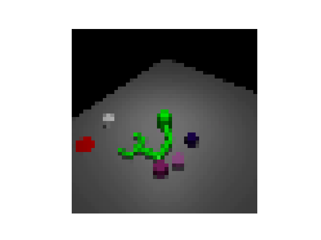|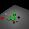|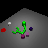|
|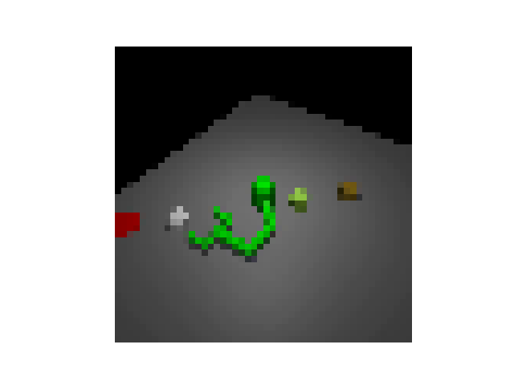|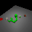|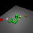|
|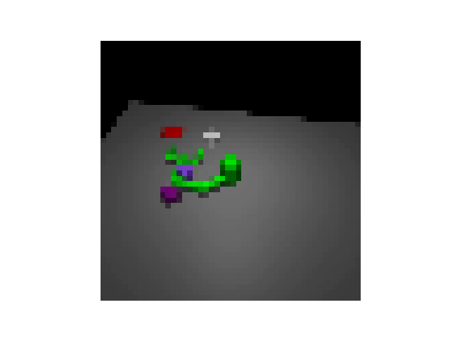|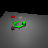|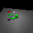|
|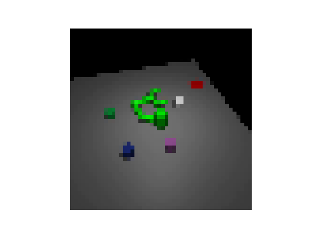||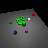|
|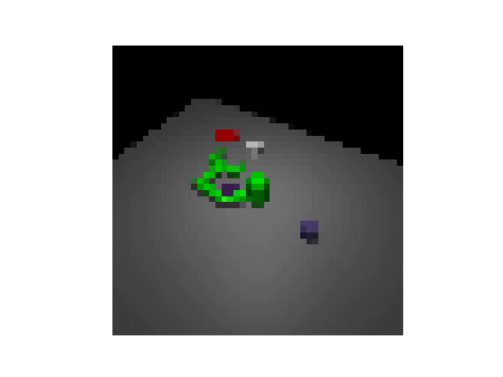||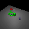|

