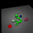
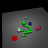

# Imitation from Observation (IfO)
Imitation from observation TensorFlow 2.0 implementation

## References
### Paper
- Liu, YuXuan, et al. ["Imitation from observation: Learning to imitate behaviors from raw video via context translation."](https://arxiv.org/pdf/1707.03374.pdf) 2018 IEEE International Conference on Robotics and Automation (ICRA). IEEE, 2018.
### Github
- https://github.com/wyndwarrior/imitation_from_observation
### Project Page
- https://sites.google.com/site/imitationfromobservation/

## Usage
1. Train expert and collect demonstration data using ["dataset"](../dataset/README.md)
2. Train the translator.
- For example, execute ["IfO_pusher_sim.py"](./pusher/translator/IfO_pusher_sim.py)
    - To do this, you need to edit your gym environment. Please refer my ["gym"](../gym).
3. Train IfO agent using trained translator and RL algorithm (ex. PPO)
- For example, execute ["train.py"](./pusher/IfO_rl_train/train.py)
    - To do this, you need OpenAI Baslines tf2 branch and ["custom_run.py", "custom_cmd_util.py"](https://github.com/gemst1/baselines/tree/tf2).

## Results
### Translator results
|Source|Translated|
|:------:|:------:|
|||
|||
### IfO results